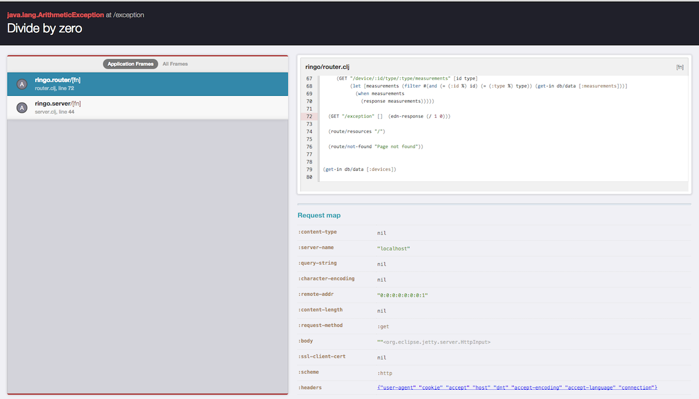

Ringo
=====

A starterkit for building apps with Bootstrap, Om, and Ring. Optimized for beginner Clojure/Clojurescript developers.

## Rationale

The Clojure community builds libraries that do one thing and one thing only, and justifiably so. However, newcomers to the community — especially those coming from the world of Express, Flask, or Sinatra could benefit from a curated web stack composed of mature libraries and middleware to get things done.

Ringo is an effort to realize that core.

    lein new ringo kickstart

## Goals

- Separate workflows for Design, UI, and API development
- Unified `bower.json` + `profiles.clj` build pipeline
- Static server and _async_ webserver (http-kit)
- Frontend asset pipeline
- Curated Ring middleware
- OAuth2
- Ajax & core.async
- nRepl over http!
- Error handling for humans
- Visual debugger in the browser

How about debugging Ring Requests? Thanks to Magnar's [Prone](https://github.com/magnars/prone), this is a breeze.

_Core dependencies_

Ring/Compojure, Om/Sablono, Bootstrap/Less

## Usage

First-time Clojure developers, assuming you have [jdk7 or above](http://www.oracle.com/technetwork/java/javase/downloads/jdk8-downloads-2133151.html), must first install leiningen (a build and task runner similar to mvn, pip, or npm):

    brew install leiningen

Checkout new leiningen template (a boilerplate/generator for new projects)

    lein new ringo kickstart

Run server, auto reload classes, compile less files, and compile cljs->js, all in one go.

    lein ringo

## Editor support

[Lighttable](http://www.lighttable.com) is the best editor for beginner Clojure/Clojusrescript developers. I recommend the following plugins:

- Bracketglow
- Emmet
- Gitlight
- Paredit and rainbow
- Vim-mode (if you're a Vim fan, like me)

## Thanks

A big thanks to @weavejester for creating beautiful Clojure libraries like Hiccup, Ring and Compojure. @swannodette for his leadership and pushing the limits of Clojurescript and Om. 

Thanks to [Anna](https://github.com/annapawlicka/om-data-vis), whose examples I used and modified in this repo.

This project is inspired by the reference apps created in other communities, like [Flask](https://github.com/zachwill/flask_heroku) and [Express](https://github.com/madhums/node-express-mongoose-demo).

## Status & Roadmap

**Early development**.

The API and organizational structure are subject to change.

This project was created to enable single-page app workflows for a designer/developer duo. Future roadmap includes stabilizing the core, improving the lein template experience, and adding detailed documentation with examples, like the incredible docs of [Flask](http://flask.pocoo.org/docs/latest/).

Feedback much appreciated.

TODO:

- Integrate [Om-Bootstrap](https://github.com/racehub/om-bootstrap), as an alternate workflow to HTML5/Less
- Integrate [Garden](https://github.com/noprompt/garden)
- Better Frontend asset pipeline with [Optimus](https://github.com/magnars/optimus)
- Core.Async

## License

Copyright © 2014 Priyatam Mudivarti

Released under the Eclipse Public License, same as Clojure.
